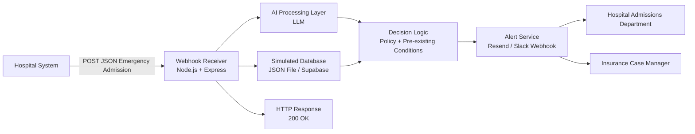

```mermaid
flowchart LR

    Hospital["Hospital System"]
    Webhook["Webhook Receiver<br/>Node.js + Express"]
    LLM["AI Processing Layer<br/>LLM"]
    Database["Simulated Database<br/>JSON File / Supabase"]
    Logic["Decision Logic<br/>Policy + Pre-existing Conditions"]
    AlertService["Alert Service<br/>Resend / Slack Webhook"]
    Admissions["Hospital Admissions Department"]
    CaseManager["Insurance Case Manager"]
    Response["HTTP Response<br/>200 OK"]

    Hospital -->|"POST JSON Emergency Admission"| Webhook
    Webhook --> LLM
    Webhook --> Database
    LLM --> Logic
    Database --> Logic
    Logic --> AlertService
    AlertService --> Admissions
    AlertService --> CaseManager
    Webhook --> Response
```